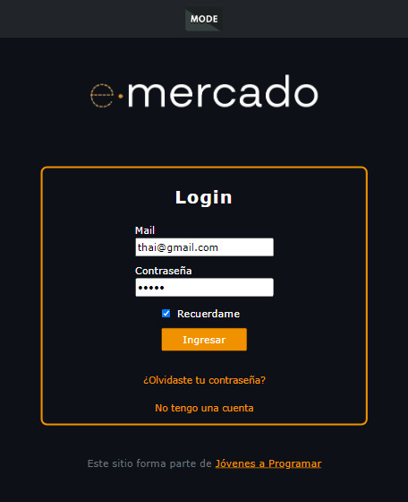
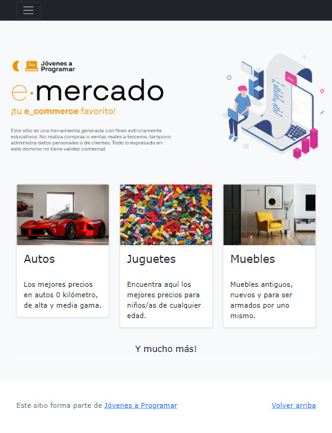

# workspace-inicial.github.io

Proyecto de tienda en línea llamado E-comerce en desarrollo para el aprendizaje y la práctica. Este proyecto tiene como objetivo implementar una tienda en línea básica con funcionalidades progresivas.

-Este proyecto se estará haciendo en equipos, en el cual todos colaboraran en la implementación de funcionalidades.

-Todos deben actualizar y bajar los cambios realizados y tenerlos en su repositorio local, realizar los commits con la información correspondiente sobre los cambios realizados.

<h2>Uso</h2>

Accede a la tienda en línea ingresando en tu navegador a: 

https://thaliaaris96.github.io/workspace-inicial.github.io/
<h2>Funcionalidades</h2>
<ul>
<li>Explorar catálogo de productos</li>
<li>Detectar si el cliente esta logeado y redirecionarlo al LogIn</li>
<li>Guardar registro</li>
<li>Buscar articulos a tiempo real</li>
<li>Productos relacionados</li>
<li>Ordenar de los productos por orden alfábetico de manera ascendente, descendente y por relevancia</li>
<li>Ver y realizar nuevos comentarios</li>
<li>Modo oscuro en toda la página</li>
<li>Agregar objetos al carrito de compra</li>
<li>Visualización del total a pagar en tiempo real</li>
<li>Agregar formas de pago</li>
</ul>
<h2>Próximas Funcionalidades</h2>
<ul>
<li>Realizar cambios en el perfil usuario</li>
<li>Apartado para que el usuario pueda vender un producto</li>
</ul>
<h2>Contribuidores</h2>

Queremos agradecer sinceramente a todas las personas que contribuyeron a este proyecto. Su dedicación y esfuerzo fueron fundamentales. ¡Gracias por hacerlo posible!, estas son: 

<ul>
<li>https://github.com/catrielmayo</li>
<li>https://github.com/ignaciodorregolagurara</li>
<li>https://github.com/thaliaaris96</li>
<li>https://github.com/pedroserna22</li>
<li>https://github.com/dreyeragustin</li>
<li>https://github.com/agustinferr</li>
<li>https://github.com/cecilialurati</li>
<li>https://github.com/marianogago</li>
</ul>
<h2>Algunas imagenes del proyecto (Próximamente)</h2>
<h3>LogIn del proyecto en modo oscuro</h3>

<h3>Página principal responsive<h3>

<h2>Proyecto Jóvenes a Programar (JAP) de CEIBAL 2023</h2>